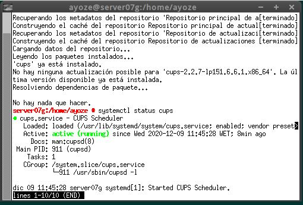
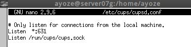
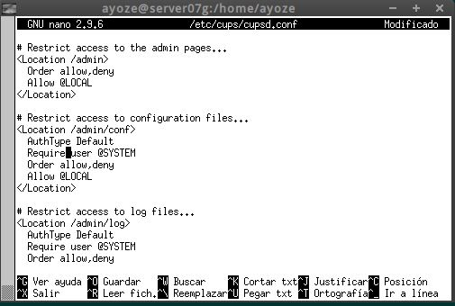
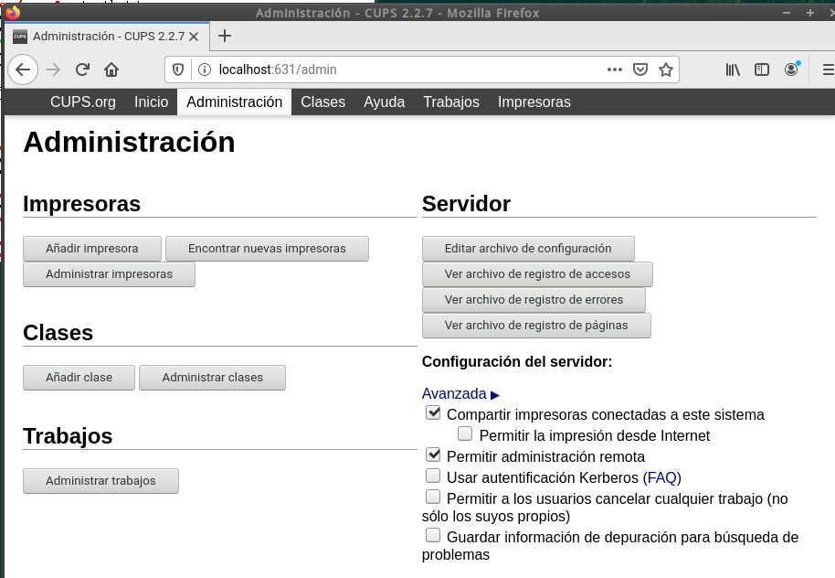
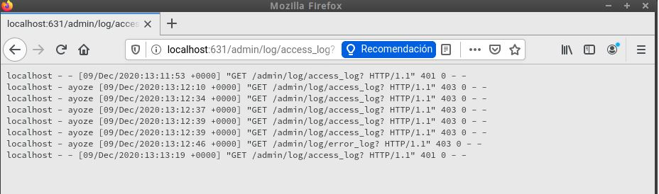
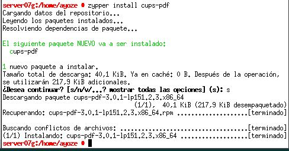
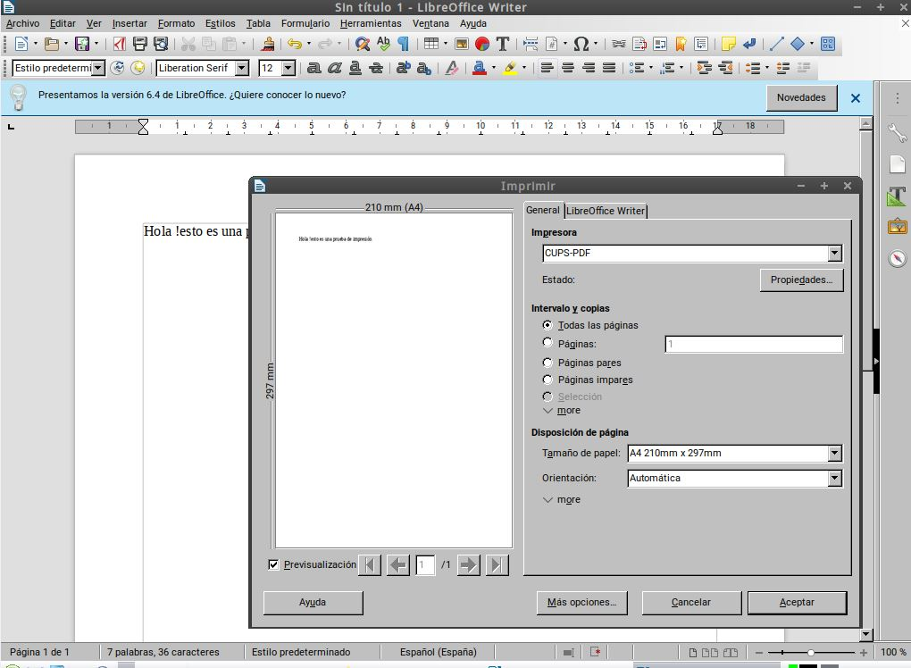
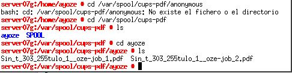
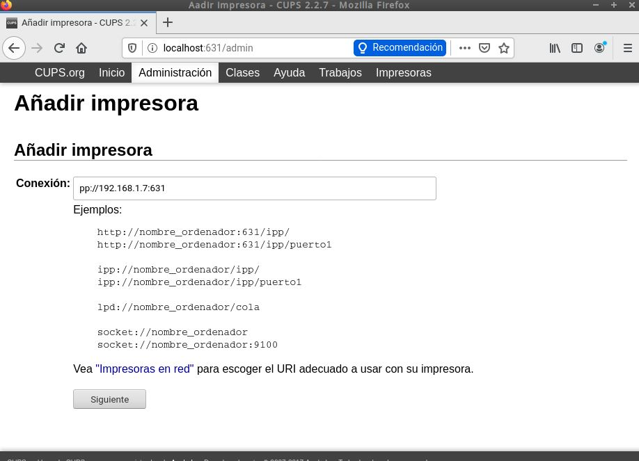
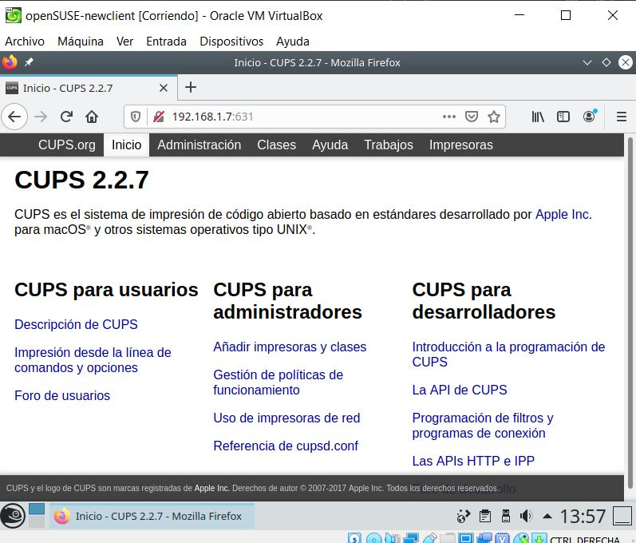

# Servidor de Impresión GNU/Linux (CUPS)

-Para esta práctica necesitaremos 2 máquinas GNU/Linux, que harán las veces de servidor y cliente.

## Servidor de Impresión

-En el servidor instalaremos el servicio **CUPS**.  
Para ello nos dirigimos a la terminal y escribimos:
*zypper install cups* y una vez instalado comprobamos el estado del servicio.

-Para configurar el servicio nos dirgimos al ficher */etc/cups/cupsd.conf* deajndolo de la siguinte manera:

-Reiniciamos el servicio y a continuación acedemos al servicio a través del navegador con *localhost:631* y nos dirigimos a la pestaña de administración.

-Una vez allí en las opciones del servidor accedemos a "ver archivo de regsitro de accesos".
Nos pedirá usuario/clave para acceder.

## Imprimir de forma local

-Para probar nuestro servicio de impresión instalaremos "cups-pdf" en el servidor.

-Una vez instalado crearemos un archivo con extensión TXT o Odf y lo intetaremos imprimir.

-El archivo una vez creado lo encontramos en el directorio
*/var/spool/cups-pdf/ayoze*

## Imprimir de forma remota

-En el servidor habilitamos la impresora como recurso de red compartido.

-Por último desde el cliente accedemos a la impresora con el navegador.

