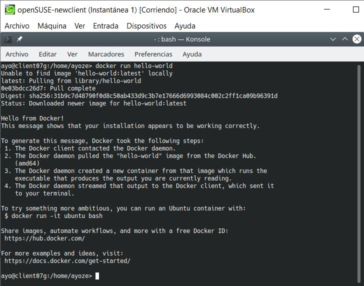

# DOCKER

*En está práctica trabajaremos con la tecnología "docker", cuya función principal es crear contenedores capaces almacenar y ejecutar archivos y aplicaciones. De está forma es mucho más sencillo migrar todo tipo de aplicaciones y herramientas entre distintas máquinas y plataformas*

## Instalación.

La instalación la realizaremos sobre una máquina con sistema operativo OpenSUSE.  
Ejecutaremos en nuestra terminal **zypper in docker** para instalar la herramienta.

Una vez instalado, con el comando **systemctl ... docker** activamos el servicio (**start**), le damos orden d ejecutarse al iniciar la máquina (**enable**) y comprobamos el estado actual del servcio (**status**).  
Tambien comprobaremos el estado de *IP_FORWARD* que debe estar activo (**1**)

## Primeros pasos.

Con el comando **docker version** comprobamos la version de la aplicacion que tenemos instalada.

Para trabajar con nuestro usuario normal previamente lo incluiremos en el grupo "docker", para que disponga de los privilegios necesarios para ejecutar la herramienta.

Ahora ejecutamos **docker run hello-world** para descargar la imagen, crear el contenedor y ejecutar la aplicación.  
**(En este punto empezó a darme problemas de privilegios la aplicación)**

**(A modo de prueba creé un nuevo usuario cuyo grupo principal seía docker, y ejecute de nuevo el comando)**

**(Al comprobar que funcionaba correctamente, volví a comprobar los grupos de mi usuario principal, cambié al mismo y probé a ejecutar de nuevo el código.)**

**(Puesto que parecía estar solucionado continue la practica con mi usuario principal.)**

Con el comando **docker images** listaremos las imagenes disponibles.  
Y con **docker ps -a**, vemos que hay un contenedor en estado 'Exited'.

Con los comandos **docker stop ID_CONTENEDOR** y **docker rm ID_CONTENEDOR** detendremos el contenedor y lo borraremos respectivamente.

## Creación manual de nuestra imagen.

*Para nuestro primer contenedor usaremos una base "debian".*

Ejecutaremos el comando **docker search debian** para buscar la imagen en los repositorios de docker.

Con **docker pull debian** descargamos una imagen desde el repositorio.

Y con **docker images** comprobamos que se ha descargado correctamente.

Vamos a crear un contenedor con nombre **app1debian** a partir de la imagen debian, y ejecutaremos el programa **/bin/bash** con el siguiente comando.

Ahora estamos dentro de debian. Vamos a personalizarlo instalando algunos programas.

Tambien crearemos un fichero html de la siguiente manera.

Por último crearemos el script **/root/server.sh** con el siguiente contenido.

Una vez creado le daremos permisos de ejecución al fichero.

## Crear una imagen a partir del contenedor.

Para crear nuestra imagen, abrimos otra terminal y ejecutamos el comando **docker commit app1debian ayoze/nginx1**.

**Aquí el servicio volvió a darme problemas de permisos. Realicé varios intentos sin éxito, hasta que reinicie el servicio y aceptó la operación.  
Deduzco que docker necesita reiniciarse cada vez que se apliquen cambios referente a los permisos**

Comprobamos que nuestra imagen se ha creado correctamente.

Ahora podremos parar y eliminar nuestro contenedor.

## Crear contenedor con Nginx.

Ya tenemos una imagen con "nginx" instalado. Ahora crearemos un contenedor a partir de ella, con el siguiente comando.

Para comprobar qu está en ejecución abrimos una nueva terminal y ejecutamos **docker ps**.

Ahora comprobamos desde el navegador con la ruta **0.0.0.0:32768** (localhost + el puerto del servicio)

Por último, probamos la ruta ha nuestro archivo **holamundo1.html**

## Migrar la imagen a otra máquina

Ahora vamos a intercambiar nuestra imagen con la de un compañero, para crear un contenedor a partir de ella.  
Para ello exportaremos la imagen a un fichero tar.
**docker save -o ayoze07docker.tar ayoze/nginx1** y la enviamos.  
Una vez tengamos la imagen del compañero, nos dirigimos a la carpeta contenedora y ejecutamos **docker load -i nombre-compañeroXXdocker.tar**.

Con docker images comprobamos que tenemos la imagen.

Creamos el contenedor con el siguiente comando y, repetimos los pasos del punto anterior para comprobar.

## Capas.

Las imágenes de docker están creadas a partir de capas que van definidas en el fichero Dockerfile.  
Con el siguiente comando comprobamos las capas de la imagen.

## Dockerfile.

En este apartado crearemos una imagen a partir de un fichero **Dockerfile**.  
Para ello, crearemos el directorio de proyecto **/home/ayoze/docker07a** donde alojaremos los ficheros. Una vez dentro, crearemos los ficheros **holamundo2.html** y el **Dockerfile** con el contenido de la imagen.

## Crear imagen a partir del Dockerfile.

Desde el directorio de trabajo con el comando **docker build -t ayoze/nginx2** crearemos nuestra imagen.

Comprobamos con **docker images**

## Crear contenedor y comprobar.

A continuación vamos a crear un contenedor con el nombre "app4nginx2", a partir de la imagen "ayoze/nginx2".

Abrimos otra terminal y comprobamos.

Ahora desde el navegador.

## Usar imagenes ya creadas.

El ejemplo anterior donde creábamos una imagen Docker con Nginx se puede simplificar aún más aprovechando imágenes oficiales que ya existen.  
Como en el apartado anterior, crearemos nuestro directorio de trabajo **docker07b** y dentro los ficheros **holamundo3.html** y **Dockerfile** como se muestra en la imagen.

Ejecutamos **docker build -t ayoze/nginx3** para crear la imagen y, **docker run --name=app5nginx3 -d -p 8083:80 ayoze/nginx3** para crear el contenedor.

Comprobamos si podemos acceder al fichero **holamundo3.html** desde el navegador

## Docker Hub.

Nuestro último proyecto será crear un contenedor llamado **holamundo** y subirlo a los servidores de **DockerHub**.  
Primero crearemos nuestro directori de trabajo **docker07c** y dentro los ficheros **Dockerfile** y **holamundo07.sh** con el siguiente contenido.

Creamos la imagen con el siguiente comando.

Y ejecutamos **docker run ayoze/holamundo** para crear el contenedor (Como vemos en la imagen, el script que creamos devuelbe algunos parámetros por pantalla, gracias a la utilidad **echo**).

Para subir la imagen al servidor previamente debemos registarnos. En mi caso utilizo **agonbe** como usuario. Un acrónimo de mi nombre y apellidos (Ayoze Gonzalez Bello).

Ahora desde la terminal nos logueamos en el servidor con la id de registro. Y etiquetamos la imagen con la etiqueta **version1**

Tan solo nos queda subir la imagen al servidor con el siguiente comando.

## Limpiar contenedores e imágenes.

Ya hemos terminado y toca hacer limpieza.  
Con el comando **docker ps -a** podremos ver las id's de los contenedores.

Vamos a pararlos y eliminarlos del sistema con los comandos **docker stop id-contenedor** y **docker rm id-contenedor**.

Haremos lo mismo con las imagenes.  
Comprobamos las id's con **docker images**.

Y con **docker rmi id-imagen** las eliminamos.

