# Servidor de Impresión en Windows

### Configuración inicial

-Para esta práctica necesitaremos un Windows Server y Windows7 que harán lo roles de servidor y cliente.

-Realizaremos las configuraciones estándar en ambas máquinas.

## Impresora compartida

 ### Rol impresión

 -En el servidor instaleremos el rol de impresión con la opción de impresión internet.

 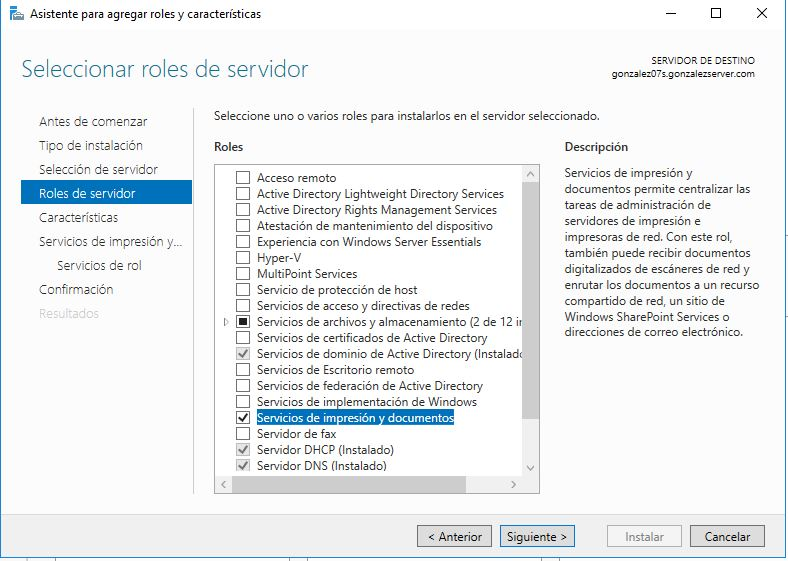
 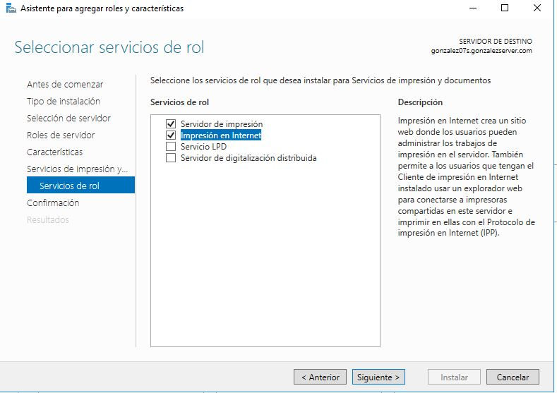

 ### Instalar impresora PDF

 -Para está practica simularemos una impresora con el programa PDFCreator que descargaremos desde su página web oficial.

 -Al iniciar la instalación es posible que le programa requiera instalar componentes adicionales para su funcionamiento.

 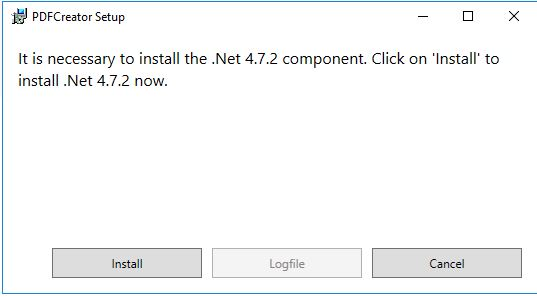

 -Una vez instalado entraremos en perfiles/guardar y marcaremos automático.

  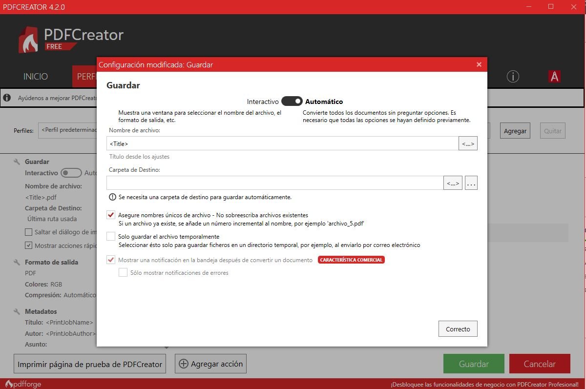

  ### Probar la impresora en local

  -Probamos la impresora creando un archivo de texto desde el bloc de notas y dandole a imprimir.

  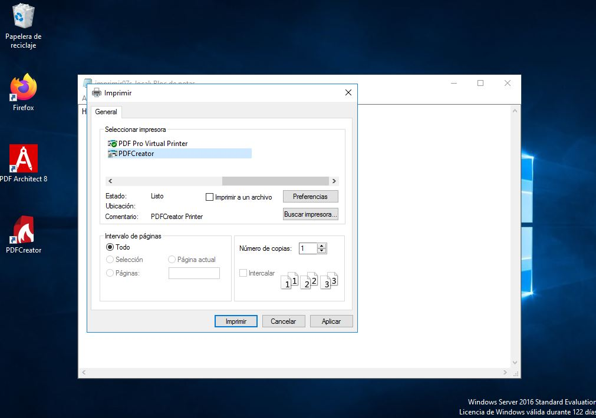

  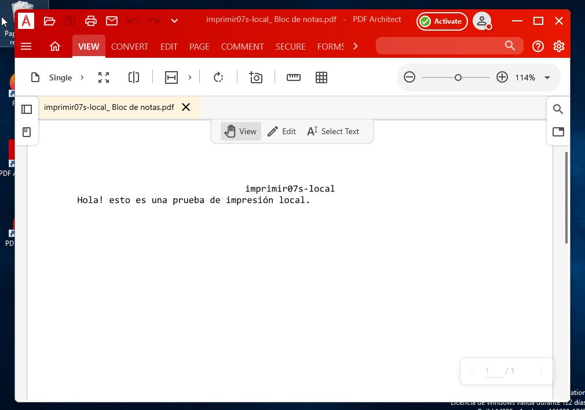

  ## Compartir por red

  -En el servidor nos dirigimos a *herramientas administrativas/administración de impresión/todas_las_impresoras* y presionamos botón derecho sobre PDFCreator. En la pestaña compartir *marcamos compartir esta impresora* y ponemos como nombre de recurso *PDFAyoze07*.

  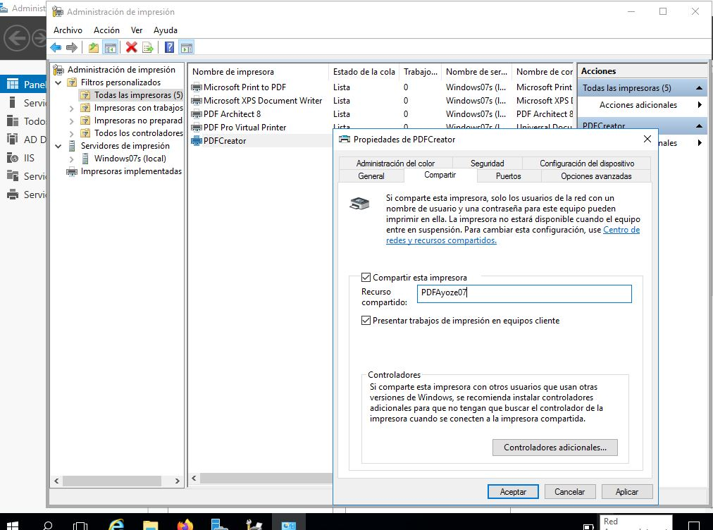

  -Ahora desde el cliente nos dirigimos a "Recursos de red" y buscamos el recurso compartido. Si tarda o no aparce podemos buscarlo desde la barra de navegación escribiendo la ip del servidor.
  Nos pedirá un usuario/clave para acceder al servidor.   --Una vez introducido, seleccionamos la impresora y con botón derecho damos en conectar.

  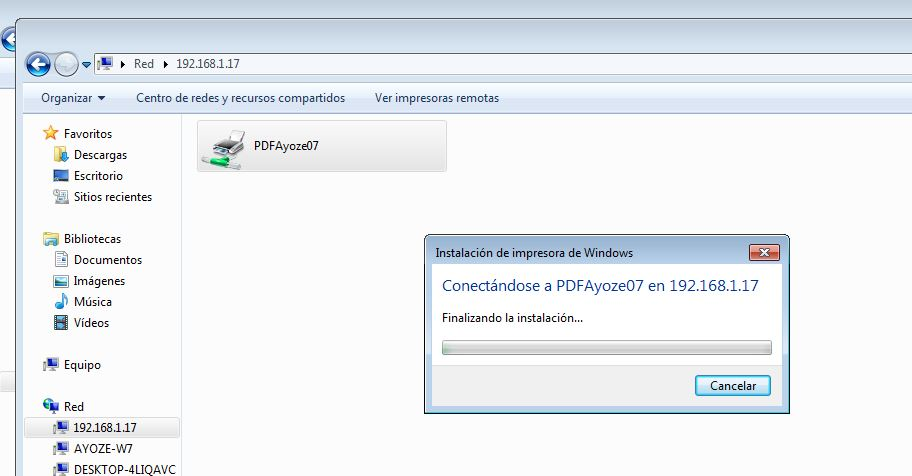

  -Ya podemos imprimir de forma remota.

  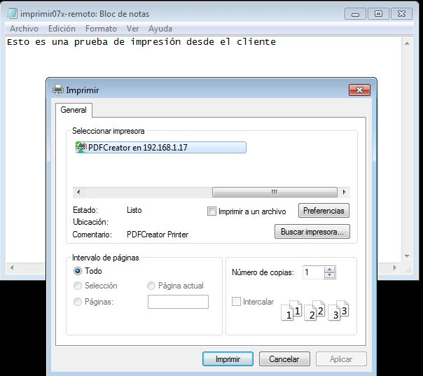

  ## Acceso Web

  ### Instalar característica impresión WEB

  -Desde la máquina cliente nos dirigimos al navegador para localizar la impresora de una forma distinta.

  -Escribimos la *\\192.168.1.17\printers*, nos volverá a pedir usuario/clave para acceder.

  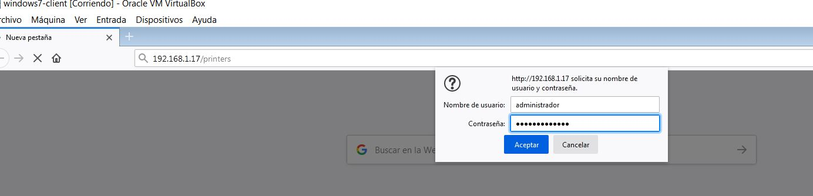

  -Una vez dentro buscaremos la opción de propiedades y apuntaremos los datos que nos proporciona.

 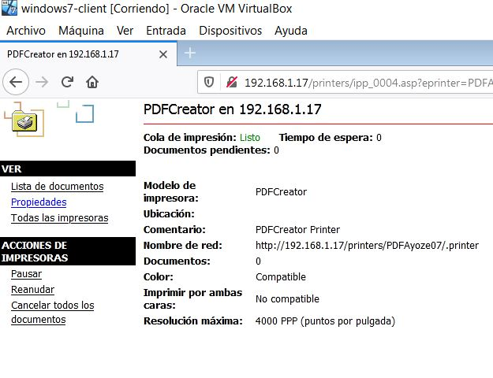  
