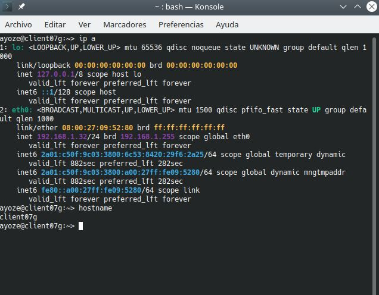
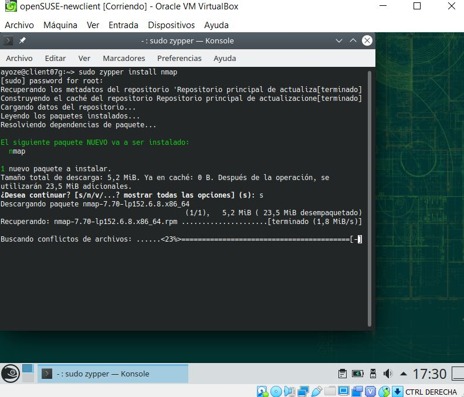
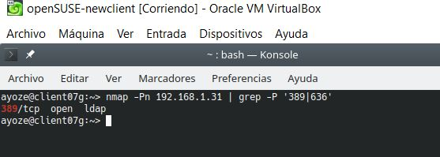
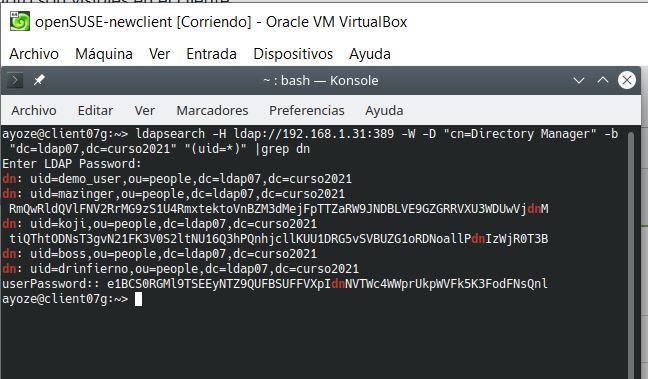
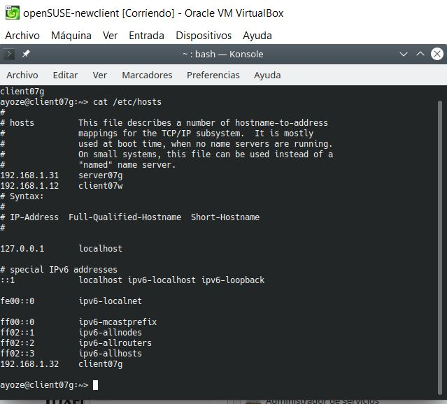
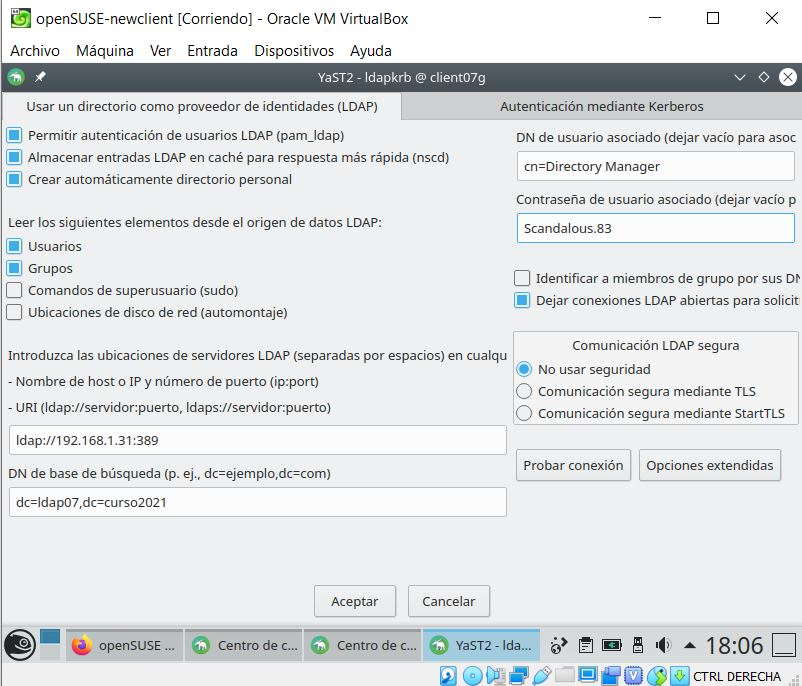
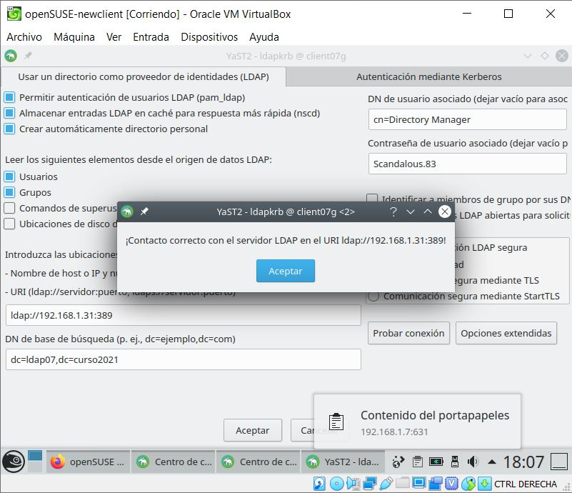
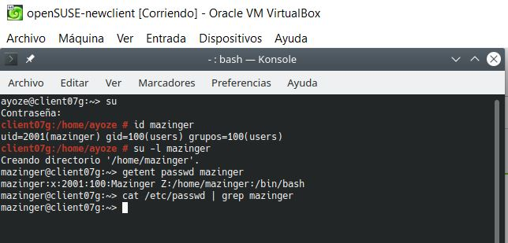

# Autenticación con 389-DS

## Requisitos

Para la realización de está práctica, necesitaremos 2 máquinas con SO "OpenSUSE", que tendrán los roles de servidor y cliente.  
Nuestro servidor ya debe estar configurado con los servicios y opciones necesarias, puesto que está actividad es continuación de la anterior.  

### Cliente para autenticación LDAP

Para el cliente configuraremos tanto el nombre como la ip estática que le corresponden.

Una vez configurado vamos a comprobar desde la terminal de nuestro cliente que los puertos de "ldap" del servidor son visibles.  
Para ello instalaremos el programa "nmap" si no lo tenemos previamente en nuestra máquina.

Y ejecutamos el comando **nmap -Pn 192.168.1.31 | grep -P '389|636'**

Como podemos comprobar en la imagen el puerto 389 es visible.   
El puerto 636 tendriamos que activarlo en el cortafuegos de nuestro servidor, pero puesto que solo se usa para las conexiones seguras de ldap (ldaps), y no las usaremos en está práctica, podemos obviarlo y continuar.

Ahora ejecutaremos **ldapsearch -H ldap://192.168.1.31:389 -W -D "cn=Directory Manager" -b "dc=ldap07,dc=curso2021" "(uid=*)" | grep dn** para comprobar que los usuarios del ldap remoto son visibles desde el cliente.

## Configurar autenticación LDAP

### Crear conexión con servidor

Vamos a crear una conexión entre el cliente y el servidor.  
Previamente nos aseguramos de tener bien nuestro nombre de equipo y dominio.

Ahora iniciamos "Yast" y buscamos "Ldap y Kerberos".
Se nos abrirá una ventana de configuración que dejaremos como la siguiente imágen.

Una vez configurado, pulsamos en probar conexión.

### Comprobar con comandos

Ahora, nos dirigimos a nuestra terminal en el equipo cliente y como usuario "root", ejecutamos los siguientes comandos.

**id mazinger** (comprobamos que el usuario existe)  
**su -l mazinger** (Entramos con el usuario definido en LDAP)  
**getent passwd mazinger** (Comprobamos los datos del usuario)  
**cat /etc/passwd | grep mazinger** (El usuario NO es local)

