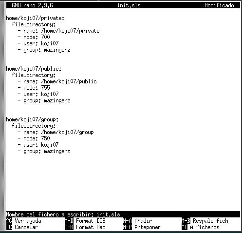

# Salt-Stack

Está herramienta se encuentra dentro del grupo de gestores de infraestructura, cuya principal funcionalidad es, automatizar ordenes para que los hosts esclavos (**minions**) del sistema anfitrión puedan descargar dichas ordenes automáticamente al conectarse al nfitrión (**master**).

## Configuraciones previas

**NOTA**  
*Es importanrte que se establezcan nombres e ip's estáticas a las máquinas antes de comenzar la instalación de la herramienta, puesto que se crean conexiones entre el master y los minions basadas en esos parámetros.*

- Para está práctica utilizaremos 2 máquinas con SO OpenSUSE con los siguientes parámetros.

  *Master*
  Nombre- master07g
  Alias- master
  Ip- 172.19.7.31 / 192.168.1.31

  *Minion*
  Nombre- minion07g
  Alias- minion
  Ip- 172.19.7.32 /192.168.1.32

## Master.

- Una vez configuradas las máquinas instalaremos la herramienta en el master con **zypper install salt-master**

- Ahora modificaremos el archivo de configuración */etc/salt/master* de la siguiente manera:

- Una vez hecho ejecutamos **systemctl enable salt-master.service** para que el servicio se active al iniciar el sistema y **systemctl start salt-master.service** para arrancarlo. Por último comprobamos con **salt-key -L** los clientes (*minions*) conectados.

## Minion

- Ahora configuaremos el servcio en nuestro minion.
Ejecutamos **zypper install salt-minion** para instalarlo.

- Tendremos que modificar el archivo de configuración para indicar quien será nuestro master.

- ahora ejecutamos los comandos para activar el servicio.

- y comprobamos que no tenemos *apache* instalado.

### Cortafuegos

- Volvemos a la máquina *master* para definir algunas reglas en el cortafuegos.
Ejecutaremos **firewall-cmd --get-active-zones** para comprobar la zona de nuestra red, **firewall-cmd --zone=public --add-port=4505-4506/tcp --permanent** para abrir los puertos 4505 4506 de forma permanente en la zona pública, **firewall-cmd --reload** para recargar el cortafuegos y **firewall-cmd --zone=public --list-all** para comprobar que los cambios han surtido efecto.

### Aceptación desde el Master

- Si volvemos a jecutar **salt-key -L** veremos que tenemos una solicitud de nuestro minion.

- Lo aceptamos con **salt-key -a minion07g** y comprobamos.

### Comprobamos conectividad

- Con los siguientes comandos comprobamos si hay conectividad entre ambas máquinas y la version de salt instalada en el minion.

## Salt States

### Preparar el directorio para los estados

- Vamos a crear directorios para guardar lo estados de Salt. Los estados de Salt son definiciones de cómo queremos que estén nuestras máquinas.
Para ello crearemos el archivo **/etc/salt/master.d/roots.conf** con el siguiente contenido y reiniciamos el servicio.

### Crear un nuevo estado

- Vamos a crear un nuevo estado que instale apache en nuestros minions. Para ello crearemos el siguiente archivo **/srv/salt/base/apache/init.sls** con la siguiente configuración:

### Asociar Minions a estados

- Para vincular los minions con los estados craremos el archivo top.sls con la siguiente configuración:

### Comprobar estados definidos

- Podemos comprobar el vinculo con el siguiente comando:

### Aplicar el nuevo estado

- Para comprobar en detalle los estados usaremos los siguientes comandos:

- Si todo está correcto ejecutamos el **salt '*' state.apply apache** para aplicar el estado:

## Crear más estados

### Estado Users

- Vamos a crear un grupo con varios usuarios del mismo mediante estados.    
Para ello empezaremos modificando el archivo top.sls para incluir el nuevo estado.

- Ahora crearemos el archivo **/srv/salt/base/users/init.sls** con la siguiente configuración:

- Por último aplicamos el estado con **salt '*' state.apply users**.

### Estado Dirs

- Vamos a crear algunos directorios dentro del home de nuestro usuario koji07.    
Comenzamos modificando el archivo top.sls para incluir el nuevo estado.

- Ahora crearemos el archivo **/srv/salt/base/dirs/init.sls** con la siguiente configuración:

- Por último aplicamos el estado.

