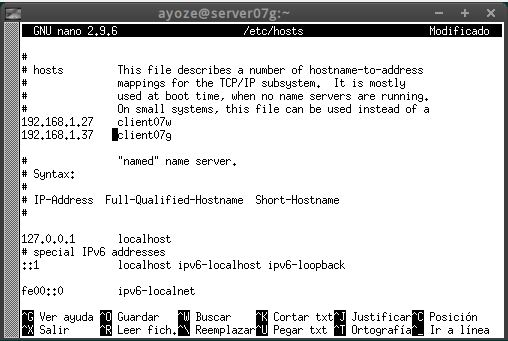

# Samba (con OpenSUSE y Windows)

"Para esta práctica necesitaremos dos máquinas con SO OpenSuse y una Windows7".

-Usaremos una máquina OpenSUSE como servidor (server07g). tanto la otra OpenSUSE como la Windows harán el rol de clientes.

La configuración de red será la siguiente:

  - **server07g** ip 192.168.1.7
  - **client07g** ip 192.168.1.37
  - **client07w** ip 192.168.1.27

-Una vez configuradas nos dirigimos al servidor y modificamos el fichero /etc/hosts para incluir a los clientes.

