# Samba (con OpenSUSE y Windows)

### Configuración inicial

**"Está práctica estaba incompleta y la he terminado con capturas de los pasos sin terminar. La configuración inicial de las máquinas no era la misma. Varian nombres de host e ips en algunos puntos."**

"Para esta práctica necesitaremos dos máquinas con SO OpenSuse y una Windows7".

-Usaremos una máquina OpenSUSE como servidor (server07g). tanto la otra OpenSUSE como la Windows harán el rol de clientes.

La configuración de red será la siguiente:

  - **server07g** ip 192.168.1.7
  - **client07g** ip 192.168.1.37
  - **client07w** ip 192.168.1.27

-Una vez configuradas nos dirigimos al servidor y modificamos el fichero /etc/hosts para incluir a los clientes.

## GNU/Linux

### Usuarios y grupos

-Ahora crearemos los grupos *piratas*, *soldados* y *sambausers*.

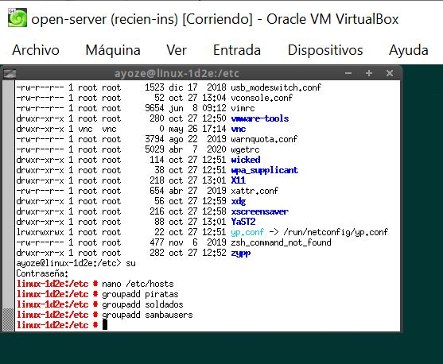

-Una vez creados los grupos crearemos el usuario *sambaguest* y modificaremos el fichero */etc/passwd* poniendo el valor */bin/false* para que nadie pueda pueda entrar mediante login con ese usuario.

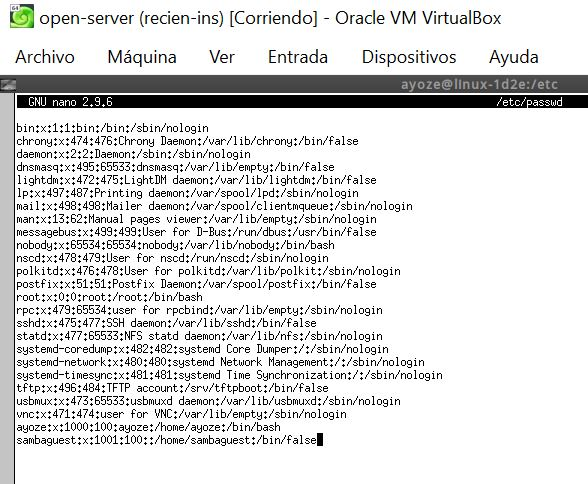

-Dentro del grupo piratas incluimos a los usuarios pirata1, pirata2 y supersamba.

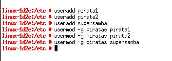

-Dentro del grupo soldados incluimos a los usuarios soldado1 y soldado2 y supersamba
y en el grupo sambausers, a todos los usuarios soldados, piratas, supersamba y a sambaguest.

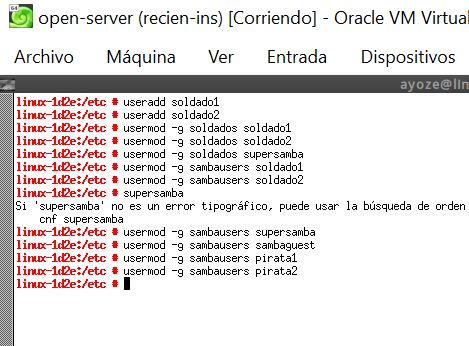

### Crear las carpetas para los futuros recursos compartidos

-Crearemos las carpetas para los recursos compartidos.
-Crearemos como carpeta  base */srv/samba07* dandole permisos *755*. Y dentro de la misma crearemos las carpetas *public.d, castillo.d y barco.d* asigandoles permisos *770*.

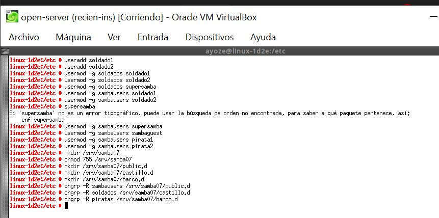

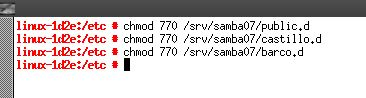

### Configurar el servidor Samba

-Pasamos a configurar el servidor samba. Para ello nos dirigimos a *Yast* y buscamos la opción *samba server*

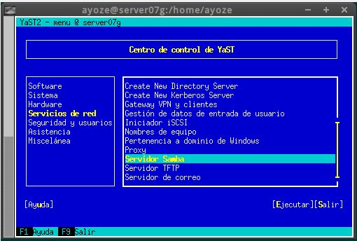

- Ponemos como grupo de trabajo curso2021 y sin controlador de dominio.

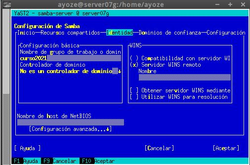

-Desde la terminal de otra máquina GNU/Linux comprobamos que los puertos *139/445* están abiertos.

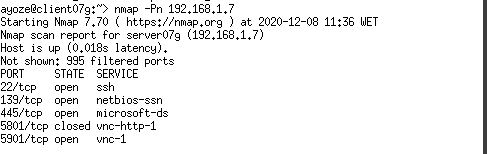

### Crear los recursos compartidos de red

-Tenemos que conseguir una configuración con las secciones: global, public, barco, y castillo como la siguiente:

  - public, será un recurso compartido accesible para todos los usuarios en modo lectura.
  - barco, recurso compartido de red de lectura/escritura para todos los piratas.
  - castillo, recurso compartido de red de lectura/escritura para todos los soldados.

-Para ello modificaremos el fichero de configuración */etc/samba/smb.conf* de la siguiente forma:

 - [global]
  netbios name = server07g
  workgroup = curso2021
  server string = Servidor de ayoze07
  security = user
  map to guest = bad user
  guest account = sambaguest

 - [public]
  comment = public de ayoze07
  path = /srv/samba07/public.d
  guest ok = yes
  read only = yes

 - [castillo]
  comment = castillo de ayoze07
  path = /srv/samba07/castillo.d
  read only = no
  valid users = @soldados

 - [barco]
  comment = barco de ayoze07
  path = /srv/samba07/barco.d
  read only = no
  valid users = pirata1, pirata2

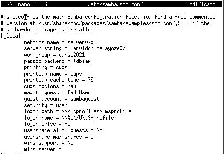

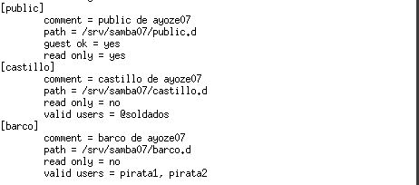

### Usuarios Samba

-Ahora pasaremos a crear las claves de cada uno de los usuarios de samba.

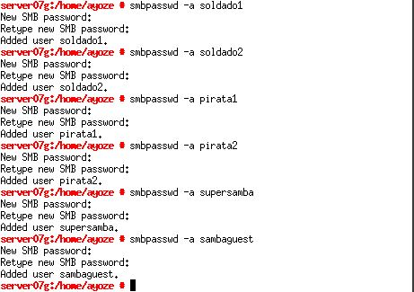

-Una vez configurado el servidor reiniciamos el servicio y comprobamos el estado del servicio.

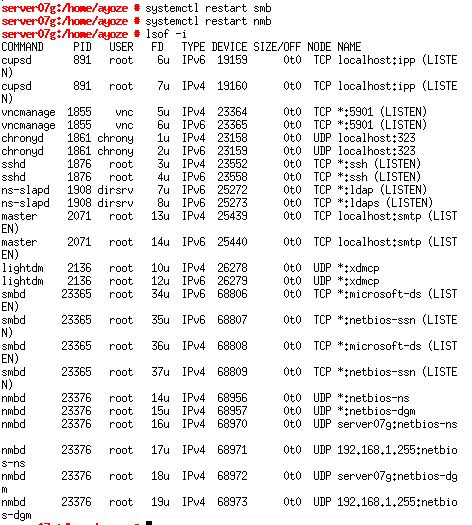

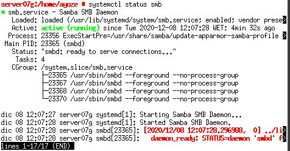

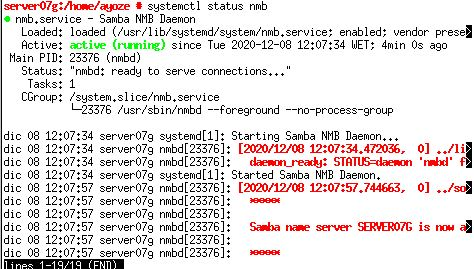

## Windows

### Cliente Windows

-Lo primero que haremos será modificar el fichero */etc/hosts* para añadir las máquinas *server07g y client07g*.

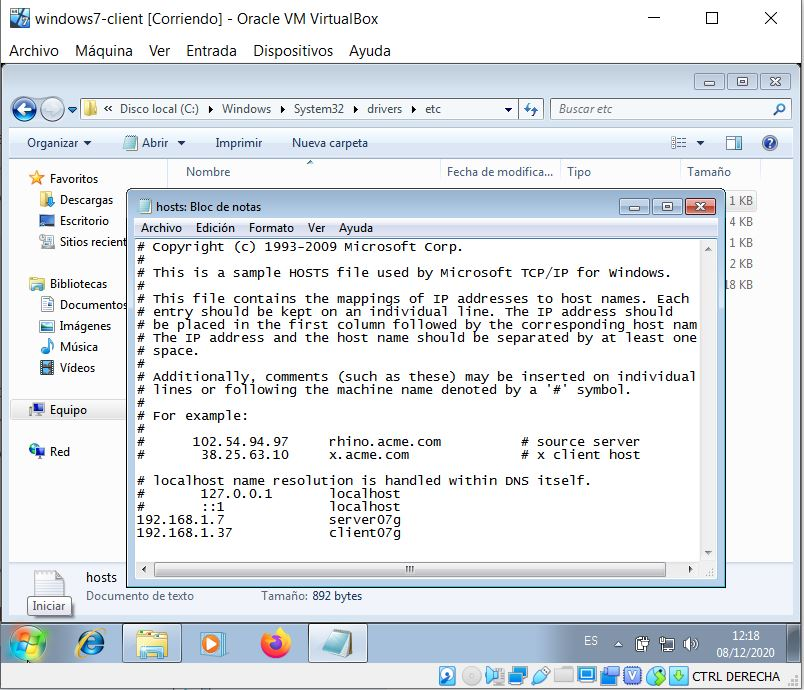

-Ahora accederemos mediante la ip del servidor a los recursos compartidos.

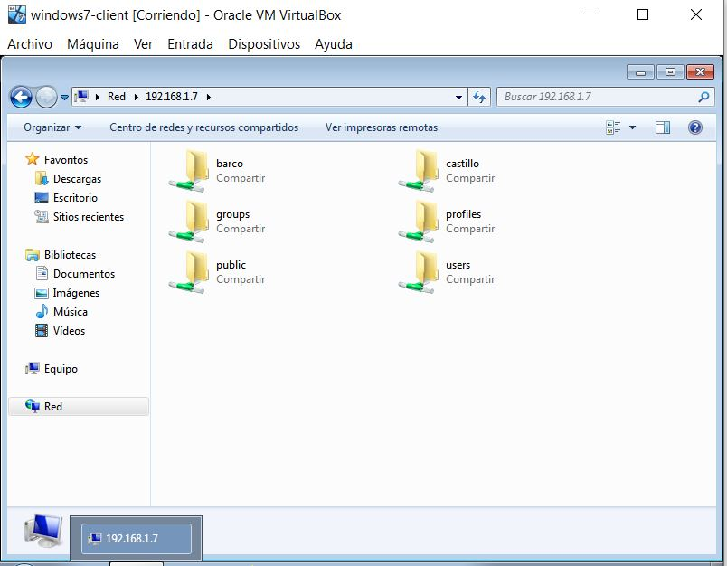

-Vamos a acceder al recurso compartido public y usaremos el comando *net use* para ver las conexiones abiertas y
*net use * /d /y,* para borrar todas las conexión SMB/CIFS que se hayan realizado.

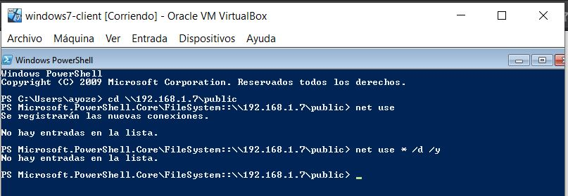

-- *(Acceder al recurso compartido castillo con el usuario soldado.*  
*net use para ver las conexiones abiertas.   
net use * /d /y, para borrar todas las conexión SMB/CIFS que se hayan realizado.*
*Acceder al recurso compartido barco con el usuario pirata.*  
*smbstatus, desde el servidor Samba.
    lsof -i, desde el servidor Samba.)*

"**Esta parte de la práctica no la supe realizar, no se si por falta de conocimientos o porque no entendi bien a que se refiere**" --

### Cliente Windows comandos

-Abrimos la powershell de Windows y ejecutamos *net use*
para comprobar que no hay conexiones y *net view* para ver los recursos del servidor.

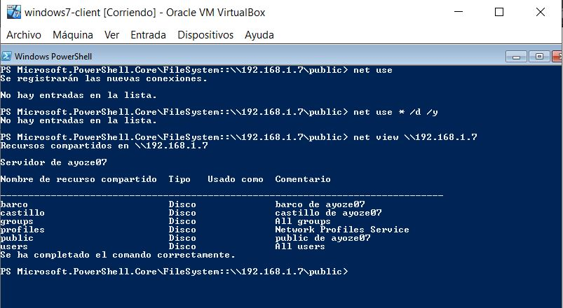

-Montaremos el recuros *barco* de forma permanente. Para ello ejecutamos el siguiente comando:

*net use S: \\192.168.1.7\barco Agonb3 /USER:pirata1 /p:yes*

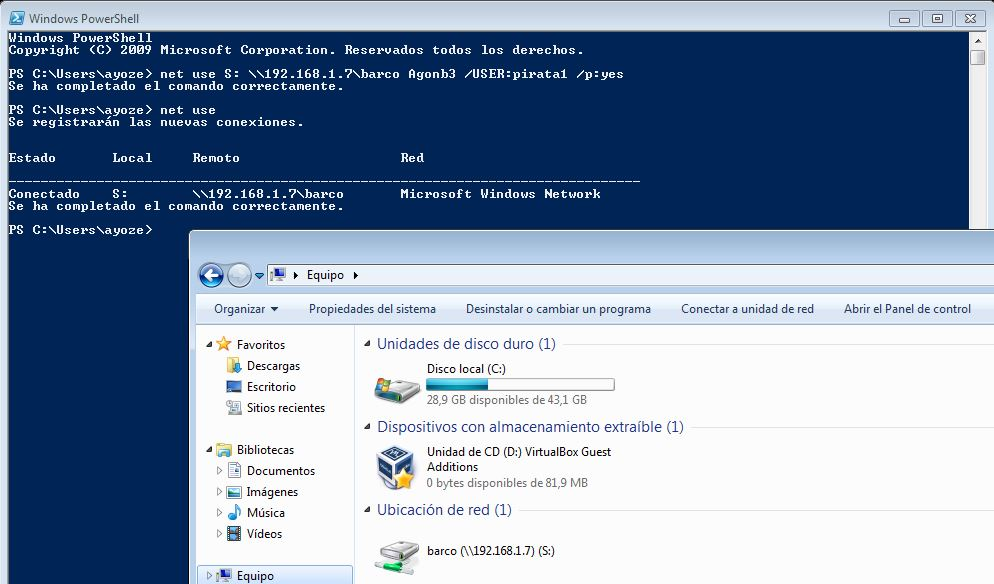

-Ahora desde el servidor comprobamos el registro.

## Cliente GNU/Linux

### Cliente GNU/Linux GUI

-Nos dirigimos al fichero */etc/hosts* para incluir las máquinas *server07g y client07w*.

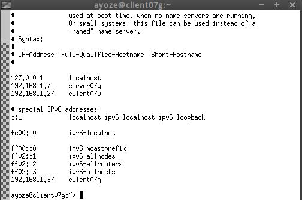

-Desde en entorno gráfico, podemos comprobar el acceso a recursos compartidos SMB/CIFS.
-Entramos a un directorio cualquiera y presionamos CTRL+L y escribimos en el buscador smb://192.168.1.7

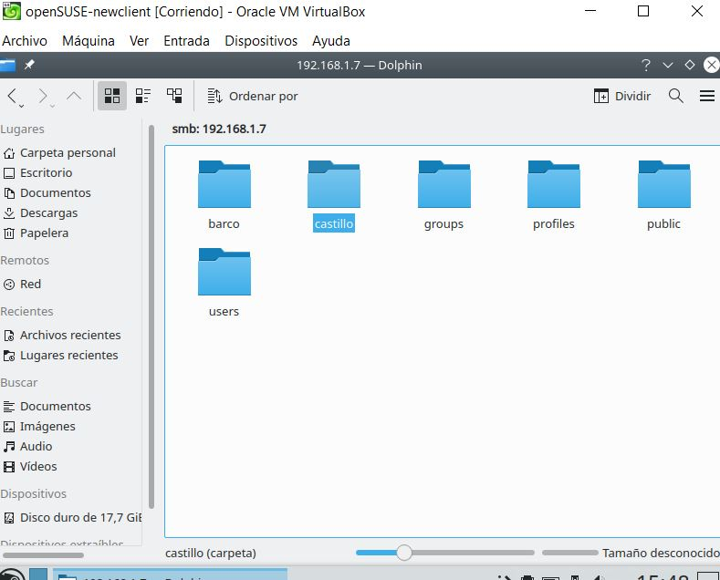

**A partir de aquí la práctica no dejo de darme errores.
No consegui acceder a los directorios de ninguna manera(comprobe nombre de netbios en samba, probe a poner nombre de dominio, cambie de usuarios, deshabilite cortafuegos, etc...)**

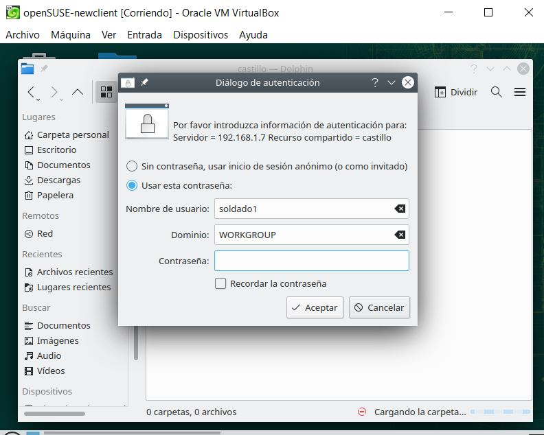

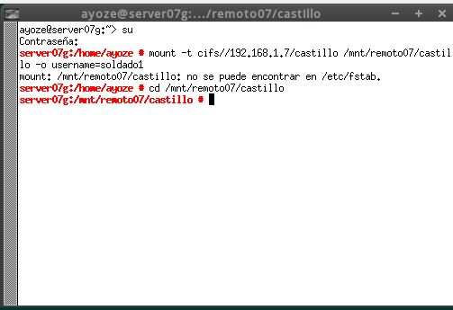

**Despues de varias horas sin conseguir solucionarlo decidí cambiar de actividad por falta de tiempo**
