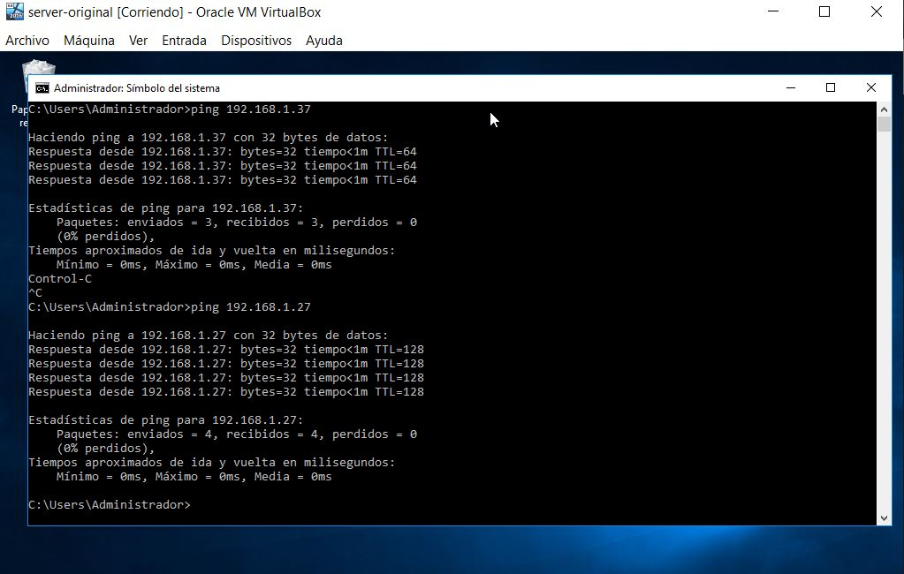

# Acceso Remoto SSH

### Instalaciones Previas

-Para esta práctica necesitaremos configurar 4 máquinas virtuales 2 con sistema operativo OpenSuse y otras 2 con Windows que harán las veces de servidores y clientes de la siguiente manera.

Opensuse Server (sin entorno gráfico) Ip: 192.168.1.7 nombre: server07g.

Windows Server 2016                   Ip:192.168.1.17 nombre: server07w.

Windows7 Cliente                      Ip:192.168.1.27 nombre: client07w.

OpenSuse Cliente                      Ip:192.168.1.37 nombre: client07g.

### -Servidor OpenSuse.

-Una vez instalado modificaremos el archivo /etc/hosts para incluir los datos de los clientes.

Realizaremos las comprobaciones para verificar que lo hemos configurado correctamente.

-Ahora crearemos 4 nuevos usuarios en el servidor.

### OpenSuse cliente

-Ahora pasamos a configurar el cliente. Al igual que con el servidor nos dirigimos a /etc/hosts para incluir los datos del servidor y del cliente Windows.

-Hacemos ping para comprobar que hay conexión.

### Cliente Windows7

-Para instalar el cliente ssh en Windows descargaremos el programa "PuTTY" desde su web oficial.

-Nos dirigimos a "C:\Windows\System32\drivers\etc\hosts" y modificamos el archivo con el bloc de notas incluyendo los hosts client07g y server07g. Probablemnte no podremos modificar el archivo por falta de privilegios. Una de las posibles soluciones es guardar el archivo modificado en otra ubicación del disco y luego borrar el original y sustituirlo.

-Nuevamente hacemos ping a ambos equipos para comprobar la conexión.

### Instalación del servicio SSH en el servidor

-Nos dirigimos a la terminal del servidor e instalamos el servicio con "sudo zypper install openssh".

-Comprobamos el estado del servicio y si el puerto 22 esta escuchando.

### Primera conexión SSH desde cliente GNU/Linux

-Desde el cliente hacemos ping al servidor para comprobar la conectividad y con el comando "nmap -Pn" comprobaremos si el puerto 22 está abierto.
-Ahora nos conectaremos al servidor con el primer usuario creado en el servidor. Para ello escribimos "ssh gonzález@server07g"

-Vamos a comprobar el contenido del fichero $HOME/.ssh/known_hosts (Es la clave de identificación del servidor).

### Primera conexión SSH desde cliente Windows

-Para conectarnos usaremos la aplicación PuTTY que anteriormente habiamos instalado. Tendremos que introducir la ip de destino, el puerto de escucha, usuario y contraseña.

-Una vez intentemos acceder podremos ver el intercambio de claves.

### Cambiamos la identidad del servidor

-Vamos a cambiar las claves del servidor a ver que sucede.
-Para verificar que existen los ficheros *"ssh_host*key* y *ssh_host*key"* que se corresponden con las claves nos dirigimos al direcorio "/etc/ssh".

-Modificamos el fichero "/etc/ssh/sshd_config" comentando todas las lineas menos la siguiente "HostKey /etc/ssh/ssh_host_rsa_key". con esto indicamos al servidor que solo se utilizaran claves de tipo RSA.

### Regenerar certificados

-En el servidor nos identificamos como root y ejecutamos "ssh-keygen -t rsa -f /etc/ssh/ssh_host_rsa_key". (Dejaremos la contraseña en blanco).

-Reiniciamos el servicio y comprobamos su estado.

### Comprobamos

-Ahora intentamos conectarnos desde el cliente GNU/Linux.

-Como podemos observar nos da un sms de error en el que hace referencia a la clave RSA.
-Para solucionarlo debemos copiar la clave a la que hace referencia el aviso y copiarla en el fichero de configuarción "/root/.ssh/known_hosts".

-Al conectarnos desde el cliente de Windows vemos tambien un sms de advertencia.

-A diferencia del cliente GNU/Linux solo tendremos que aceptar y ambos sistemas haran el intercambio de claves de nuevo.

### Personalización del prompt Bash

-En la máquina servidor editamos el fichero "/home/gonzalez/.bashrc" escribiendo el siguiente código:

*if* *[ -n "$SSH_CLIENT" ];*    

 *then*  

   PS1="AccesoRemoto_\e[32m\u@\h:\e[0m \w\a\$ "*                                                                     

*else*
   *PS1="\[$(pwd)\]\u@\h:\w>"*

*fi*

-Además crearemos el archivo "/home/gonzalez/.alias" con el siguiente contenido:

*alias c='clear'*

*alias g='geany'*

*alias p='ping'*

*alias v='vdir -cFl'*

*alias s='ssh'*

-Ahora probamos a conectarnos desde el cliente.

### Autenticación mediante claves públicas

-Ahora modificaremos la configuración de ssh para poder acceder desde el cliente sin necesidad de escribir las claves.  
-Para ello nos dirigimos a nuestro host client07g y con nuestro usuario normal (sin root) ejecutamos "ssh-keygen -t rsa" para generar las claves en

    /home/nombre-alumno/.ssh/id_rsa

    /home/nombre-alumno/.ssh/id_rsa.pub

    

-Para copiar la clave generada en el usuario remoto ejecutaremos el siguiente código:

"ssh-copy-id sosa@serverXXg"

-Probamos a conectarnos ahora desde los clientes y veremos que en client07g no pide contraseña y en client07w sí.

### Uso de SSH como túnel para X

-Instalaremos en el servidor una aplicación de entorno gráfico (APP1) que no esté en el cliente (Geany). Ejecutamos zypper install geany y dejamos que descargue e instale los repositorios.

-Luego nos dirigimos al fichero de configuración "/etc/ssh/sshd_config" y desmarcamos la siguiente linea:

"X11Forwarding yes"

-Reiniciamos el servicio para aplicar los cambios.

-Nos conectamos desde el cliente y comprobamos que no tenemos la aplicación en el disco local.

-Para conectarnos escribimos "ssh -X gonzalez@serverXXg" y ejecutamos el programa.

### Aplicaciones Windows nativas

-Podemos instalar aplicaciones nativas de Windows en GNU/Linux gracias al emulador *Wine*.

-Procedemos a instalarlo con "zypper install wine" y una vez instalado ejecutamos "wine --version" para comprobar la versión que tenemos instalada.

### Restricciones de uso

-Vamos a modificar la configuración del ssh para restringir el acceso remoto de uno de nuestros usuarios.

-Para ello editaremos el archivo "/etc/ssh/sshd_config" añadiendo la siguiente linea:

"AllowUsers gonzalez sopsito sosa"

(Con esta linea indicamos cuales son los usuarios que tienen la conexión autorizada.)

-Una vez modificado comprobamos que no hay errores en el fichero con "/usr/sbin/sshd -t; echo $?"

-Nos conectamos desde los clientes para comprobar las restricciones y comprobamos que en ambos clientes nos recahza la contraseña de acceso.

### Servidor SSH en Windows

**Está ultima parte de la práctica no conseguí que funcionará. Intente instalar el ssh desde la configuración de Windows Server pero no surgio efecto y luego busque información sobre como instalar el openssh pero nos encontre información fiable para instalarlo en la version 2016**

-Añadimos los hosts client07w y client07g en el fichero de configuración mediante el block de notas como ya hicimos en el cliento7w.

-Comprobamos conectividad haciendo ping a ambos equipos.

-Nos dirigimos a la configuración de la máquina y en seguridad vamos a la opcion para programadores. Dentro marcaremos la pestaña "Modo de programador" y dejaremos que el sistema cargue los nuevos archivos.

-Desde la consola powershell ejecutaremos el siguiente código para comprobar que se han instalado correctamente.

"Get-Service SshBroker,SshProxy"

**Como puedes ver la práctica finalizo aquí por la imposibilidad de seguir avanzando**
