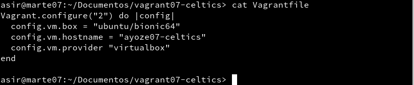

# Vagrant

## Instalar Vagrant

Para instalar el programa debemos comprobar que la versión de VirtualBox sea compatible con la versión de vagrant que vamos a instalar.  

## Proyecto Celtics

Para nuestro primer proyecto nos descargaremos la caja **"Ubuntu/Bionic64"**.
Para ello ejecutamos los siguientes comandos para descargar y comprobar que se ha descargado en nuestro equipo.

  - **vagrant box add Ubuntu/Bionic64**
  - **vagrant box list**

Por medio de la terminal crearemos un directorio para nuestro proyecto y trabajaremos dentro.  
Vamos a crear un fichero **VagrantFile**, configurándolo de la siguiente forma.

  

Una vez configurado vamos a crear nuestra primera máquina. Para ello estando dentro del directorio que hemos creado anteriormente ejecutamos el comando **"vagrant up"**.

Para conectarnos mediante ssh ejecutamos **"vagrant ssh"**.

## Proyecto Hawks

Ahora vamos a hacer otro proyecto añadiendo redirección de puertos.
Creamos el directorio "vagrant07-hawks" y nos ubicamos en el, desde la terminal.  
Vamos a crear un fichero VagrantFile de modo que el puerto 4567 del sistema anfitrión sea enrutado al puerto 80 del ambiente virtualizado.

Creamos la nueva máquina y mediante ssh entramos en ella. Ahora instalaremos el servidor web apache y comprobamos su estado.

Desde nuestra máquina vagrant abrimos el navegador web con el URL http://127.0.0.1:4567. En realidad estamos accediendo al puerto 80 de nuestro sistema virtualizado.

## Proyecto Lakers (Suministro mediante shell script)

Ahora mediante un pequeño script montaremos el servidor apache durante la instalación de nuestra máquina.
Para empezar, crearemos el directorio de trabajo **vagrant07-lakers**. Dentro de ese directorio crearemos una carpeta con el nombre **html** donde, a su vez crearemos el fichero **index.html** con el siguiente contenido.

Para el script de instalación de apache crearemos el siguiente fichero dentro del directorio de trabajo.

Ahora incluiremos en el fichero VagrantFile las siguientes lineas.

- config.vm.hostname = "ayoze07-lakers"
- config.vm.provision :shell, :path => "install_apache.sh"
- config.vm.synced_folder "html", "/var/www/html"

Con el comando vagrant up creamos la máquina y mediante el navegador comprobamos que apache se ha instalado con éxito.

## Proyecto Raptors (Suministro mediante Puppet)

Comenzaremos creando nuestro directorio de trabajo **vagrant07-raptors**.
Vamos a crear nuestro fichero VagrantFile de la siguiente manera.

Dentro de nuestro directorio creremos la carpeta **manifests** y dentro de la misma el fichero **ayoze07.pp** con las instrucciones Puppet necesarias para instalar el software que elijamos.

Para que se apliquen los cambios de configuración tenemos 2 caminos:

- Con la MV encendida  
 **vagrant reload** recargar la configuración.  
 **vagrant provision** volver a ejecutar la provisión.
- Con la MV apagada  
 **vagrant destroy** destruir la MV.  
 **vagrant up** volver a crearla.

## Proyecto Bulls (Nuestra caja)

Vamos a crear nuestra propia caja a partir de una máquina virtual que tengamos instalada.
Una vez elegida la máquina, pondremos con la tarjeta de red en modo **DHCP** e instalaremos **OpenSSH**.

 

 Ahora crearemos un el usuario **vagrant**
- **useradd -m vagrant**

Configuramos acceso por clave pública al usuario vagrant:

- **mkdir -pm 700 /home/vagrant/.ssh** para crear la carpeta de configuración SSH.  
- **wget --no-check-certificate 'https://raw.github.com/mitchellh/vagrant/master/keys/vagrant.pub' -O /home/vagrant/.ssh/authorized_keys** para  descargar la clave pública.
- **chmod 0600 /home/vagrant/.ssh/authorized_keys** modificamos los permisos de la carpeta.
- **chown -R vagrant /home/vagrant/.ssh** modificamos el propietario de la carpeta.

Vamos a conceder permisos de administrador a nuestro usuario vagrant. Para ello, modificaremos el fichero **/etc/sudoers** para que no nos pida password de root al realizar operaciones.

## Crear caja Vagrant

Una vez hayamos terminado de configurar nuestra caja, vamos a crearla.  
Crearemos el directorio **vagrant07-bulls** para nuestro proyecto.
Con el comando **VBoxManage list vms** listaremos los nombres de nuestras MVs (VMNAME).

Ejecutamos **vagrant package --base VMNAME --output ayoze07.box** para crear nuestra caja. Y comprobamos que se ha creado el fichero **ayoze07.box** en el directorio.  
Para añadir la nuestra caja al repositorio ejecutamos **vagrant box add ayoze/bulls ayoze07.box** y con **vagrant box list** lo comprobamos.

Para poder usar la nueva caja solo debemos crear un fichero VagrantFile y con **vagrant up** iniciarla.
