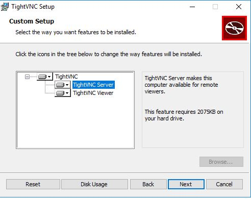
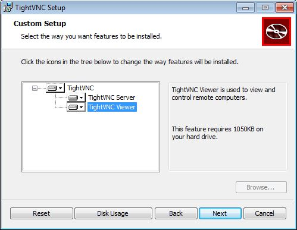

# Actividad VNC

## Instalaciones Previas

-Para esta práctica necesitaremos configurar 4 máquinas virtuales 2 con sistema operativo Open Suse y otras 2 con Windows.

### -Windows Slave

Primero configuraremos una máquina con SO Windows para que realice las funciones de servidor.
Le asignaremos una configuración ip estática dentro del rango de nuestra red y un nombre de usuario y máquina. Realizamos las comprobaciones para verificar que la hemos configurado correctamente.

### -Windows Master

Ahora pasamos a configurar el cliente. Al igual que con el servidor asignamos una ip estática y nombres de usuario y máquina y realizamos las comprobaciones pertinentes.

