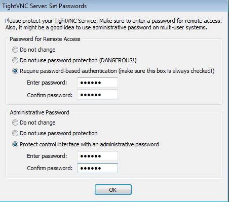
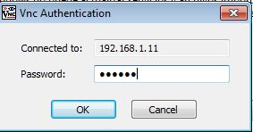
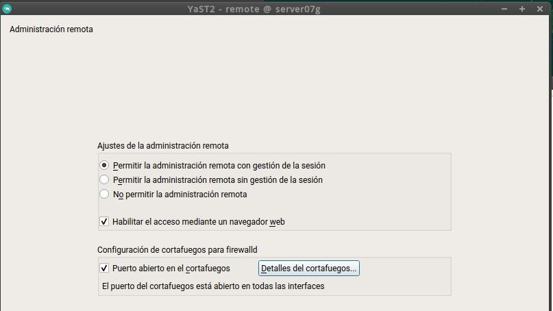
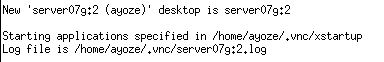
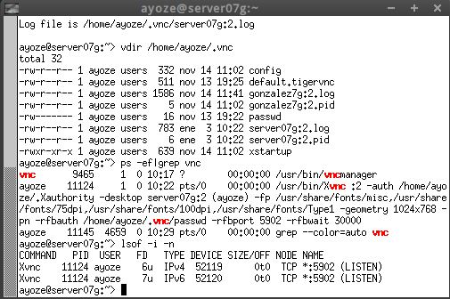
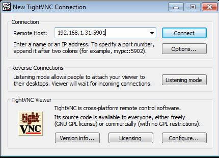

# VNC

## Instalaciones Previas.

Para está práctica deberemos configurar 4 máquinas virtuales que tendrán los roles de servidores y clientes.  
Las configuraciones de nombre e ip's serán las siguientes...  

**Windows Server 2016 (Servidor)**

**Windows 7(Cliente)**

**OpenSuse(Servidor)**

**OpenSuse(Cliente)**

### Windows Slave VNC

Para instalar el servicio Vnc-Server en Windows nos descargaremos el software libre "TightVNC" desde su página oficial.  
Una vez comencemos la instalación, elegiremos la opción "Custom" (nos permite elegir entre servidor o cliente).
 y seleccionamos la opción "TightVNC Server".  

 

 En las opciones de conexión elegiremos usar contraseña de acceso y estableceremos la misma.

 

Una vez finalizada la instalación, revisaremos en el cortafuegos, que tenemos abiertos los puertos necesarios para su correcto funcionamiento.  

Ahora, desde una máquina con GNU/Linux ejecutaremos "nmap -Pn 192.168.1.11" para comprobar que los puertos son vsibles desde fuera del servidor.

### Windows Master VNC

Para nuestro cliente de Windows tambien descargaremos "TightVNC", pero durante la instalación seleccionaremos la opción "TightVNC Viewer".   

Para verificar que la instalación de los servicios se ha hecho correctamente, nos conectaremos al "Windows Slave VNC" desde nuestro "Windows Master VNC".

Y desde nuestro cliente OpenSUSE.

Por último ejecutaremos desde nuestro servidor el comando "netstat -n" para comprobar que se ha conectado correctamente.

### OpenSUSE Slave VNC

Para configurar el servicio VNC en OpenSUSE nos dirigimos al gestor "Yast" buscamos el servicio y lo activamos.

Durante la instalación quizas sea necesario instalar algún paquete complementario.

Una vez finalizada la instalación nos dirigimos al cortafuegos para verificar que el servicio tiene los puertos habilitados.

Con nuestro usuario normal ejecutamos "vncserver" en la terminal para activar el servicio.   
Establecemos la contraseña de acceso y finalmente nos devolverá el número de escritorio remoto que necesitaremos para realizar las conexiones.

Nos dirigimos al directorio "/home/ayoze/.vnc" para comprobar que se han creado los archivos de configuración del servicio.

Ejecutaremos los comandos "ps -ef|grep vnc" y "lsof -i -n" para comprobar los servcios VNC en ejecución y los puertos que utizan respectivamente.

Desde una máquina GNU/Linux ejecutamos "nmap -Pn 192.168.1.31" para comprobar que los puertos son visibles desde fuera.

### -OpenSUSE Slave

Pasamos a configurar una máquina con OpenSUSE que hara las veces de servidor.

Una vez configurado nos dirigimos a Yast/VNC, activamos la administración remota y abrimos los puertos del cortafuegos.

Con nuestro usuario normal ejecutamos *vncserver -interfaz 192.168.1.31*
para acceder al servidor.   
Pondremos las claves de acceso.

Ahora nos mostrará nuestrro número de escritorio remoto.

Con *vdir /home/nombrealumno/.vnc* podemos ver que se han creado los registros de configuración.

Ejecutaremos *ps -ef|grep vnc* para comprobar los servicios en ejecución y *lsof -i -n* para comprobar que los puertos están abiertos.

Desde la terminal de una máquina GNU/Linux ejecutaremos nmap -Pn 192.168.1.31 para comprobar que los servicios son visibles.

Como podemos ver en la imagen el puerto 5801 no está abierto, lo que impedirá que el cliente pueda conectarse.

"**Está practica quedo incompleta. Para recuperarla debo empezar desde el principio, puesto que las máquinas originales han sido eliminadas del virtual box**"
