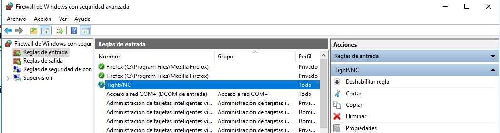
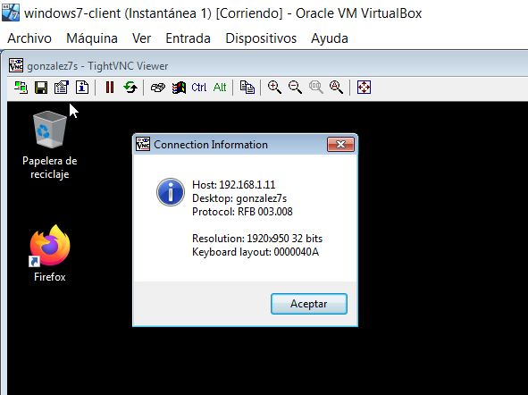

# Actividad VNC

## Instalaciones Previas

-Para esta práctica necesitaremos configurar 4 máquinas virtuales 2 con sistema operativo Open Suse y otras 2 con Windows.

### -Windows Slave

Primero configuraremos una máquina con SO Windows para que realice las funciones de servidor.
Le asignaremos una configuración ip estática dentro del rango de nuestra red y un nombre de usuario y máquina. Realizamos las comprobaciones para verificar que la hemos configurado correctamente.

Ahora buscaremos e instalaremos el servicio TightVNC Server.

Desde la terminal de una máquina GNU/Linux ejecutaremos nmap -Pn 192.168.1.7 para comprobar que los servicios son visibles.

### -Windows Master

Ahora pasamos a configurar el cliente. Al igual que con el servidor asignamos una ip estática y nombres de usuario y máquina y realizamos las comprobaciones pertinentes.

Tambien instalaremos el servicio TightVNC pero esta vez con la configuración viewer.

Ahora comprobamos que podemos conectarnos desde el cliente al servidor.

### -OpenSUSE Slave

Pasamos a configurar una máquina con OpenSUSE que hara las veces de servidor.

Una vez configurado nos dirigimos a Yast/VNC, activamos la administración remota y abrimos los puertos del cortafuegos.

Con nuestro usuario normal ejecutamos *vncserver -interfaz 192.168.1.31*
para acceder al servidor.   
Pondremos las claves de acceso.

Ahora nos mostrará nuestrro número de escritorio remoto.

Con *vdir /home/nombrealumno/.vnc* podemos ver que se han creado los registros de configuración.

Ejecutaremos *ps -ef|grep vnc* para comprobar los servicios en ejecución y *lsof -i -n* para comprobar que los puertos están abiertos.

Desde la terminal de una máquina GNU/Linux ejecutaremos nmap -Pn 192.168.1.31 para comprobar que los servicios son visibles.

Como podemos ver en la imagen el puerto 5801 no está abierto, lo que impedirá que el cliente pueda conectarse.

"**Está practica quedo incompleta. Para recuperarla debo empezar desde el principio, puesto que las máquinas originales han sido eliminadas del virtual box**"
